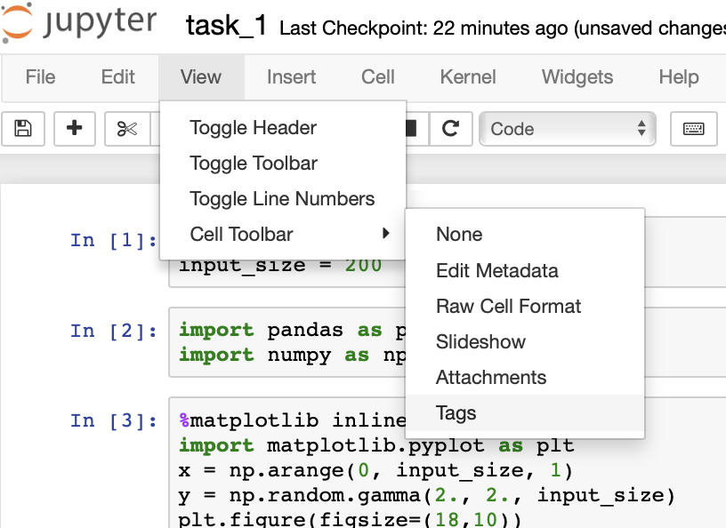

# set up jupyter "basic lab environment"
```bash
mkvirtualenv airflow_jupyter --python=python3.6
pip install jupyter ipython [and whatever else you need]
ipython kernel install --user --name=airflow_jupyter
pip install nteract_on_jupyter
pip install papermill[s3]
jupyter nteract
```

#create example notebook
```python
%matplotlib inline
import pandas as pd
import numpy as np
import matplotlib.pyplot as plt
x = np.arange(0, input_size, 1)
y = np.random.gamma(2., 2., input_size)
plt.figure(figsize=(18,10))
plt.scatter(x, y, c='r')
plt.show()
```
# add parameters cell


and then create parameters cell:


# run papermill
depending on your catalog structure the command will look approximately like this:
```bash
papermill task_1/code.ipynb task_1/output/code_exectuion_1.ipynb -f task_1/params.yaml
```

# wrap up in docker container
first off, dump and trim requirements txt to task folder as each task should have its own, as tiny as possible, virtual environment
```python
pip freeze > requirements.txt
```
now create a basic Dockerfile that spins up `run.sh`(not yet existant)

note that we will use alpine-linux which makes the resulting image lighter at the cost of more _conscious_ package installation (you might often lack basic stuff that exists on most linux distros, e.g. gcc)

if high docker image size has no impact for you, feel free to use heavier debian-based images

```dockerfile
FROM python:3.6-alpine

```